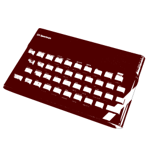
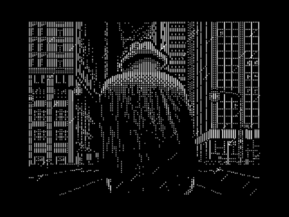
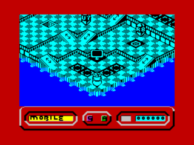
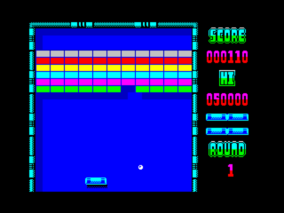
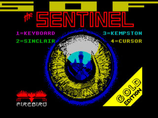

RustZX
===============================

[](https://github.com/rustzx/rustzx/actions/workflows/ci.yml)
[](https://crates.io/crates/rustzx)
[](https://github.com/rustzx/rustzx/blob/master/LICENSE.md)
[](https://discord.gg/aSHJh8UJre)



ZX Spectrum emulator written in Rust
- Watch [this](https://youtu.be/Xho3GWFyP2I) video showcase (`v0.9.x`)
- Read [CHANGELOG.md](CHANGELOG.md) for info on the latest version changes

## Features
- Written in pure rust
- Cross-platform
- Full ZX Spectrum 48K and 128K emulation
- Perfect emulation of Z80 core
- Highly precise AY chip emulation
- Beeper sound emulation
- Supported formats:
    - `tap` - tape
    - `sna` - snapshot, both 48K and 128K versions supported
    - `scr` - screenshot
- Fast loading of tap files with standard loader
- Precise timings
- Full border emulation
- Joystick emulation: Kempston, Sinclair
- Kempston mouse emulation
- Extended 128K keys emulation (arrows, backspace, caps lock)
- Quick save/load
- Compressed assets support (only `.gz` for now)
- Separate `no_std` core library which can be used to port emulator
  almost anywhere.
    - Global allocator is still needed, but all dynamic
       allocations were minimized
    - All resource-heavy features are configurable via cargo `features`
- Obscure Z80 features emulation:
    - `WZ/memptr` register (`F3/F5` flags obscure behavior in `BIT n, (HL)`)
    - `Q` register (`F3/F5` flags obscure behavior in `SCF` and `CCF`)
    - Block instruction flags [oddities](https://github.com/MrKWatkins/ZXSpectrumNextTests/tree/develop/Tests/ZX48_ZX128/Z80BlockInstructionFlags) (`LDxR`/`CPxR`/`INxR`/`OTxR`)

## Install
1. Sure that you have C compiller and CMake to
build bundled `sdl2`
2. (Linux-specific) Install required development packages: [`libasound2-dev`]
3. Install it with cargo
```bash
cargo install rustzx
```

## How to use
```bash
rustzx --help # Show help
rustzx test.tap # Autodetect file type and run in 48K mode
rustzx --ay test.tap # Run in 48K mode with AY sound chip
rustzx -m128 --tape test128.tap # Run in 128K mode with tape
rustzx --rom tester.rom -s3 # Run with custom rom and 3x screen scaling
rustzx --nofastload test.tap # Run without fast tape loading
rustzx --mouse test.tap # Run with Kempston mouse support
```
For loading tape in 48K mode, press `j` then `Ctrl+p` twice, as on real Spectrum.
You should see `LOAD ""` on emulator's screen, then press `Enter` (in 128K mode just press enter).
In `--nofastload` mode, press `Insert` to play the tape and `Delete` to stop

If you have choppy audio, try `--sound-latency` option with bigger values.

## Default key bindings:
- `F1` - quick save
- `F2` - quick load
- `F3` - set normal emulation speed
- `F4` - set 2x emulation speed
- `F5` - max possible emulation speed
- `F6` - enable frame trace info
- `F9` - enable kempston/sinclair joy keyboard layer
- `Insert` - start tape
- `Delete`- stop tape
- `End` - break command
- `Caps Lock` - caps lock command
- `Backspace` - delete
- `<Arrows>` - 128K arrow keys
- `Esc` - unlock mouse (if `--mouse` is used)

## In joy keyboard layer mode (F9)
- `<Arrows>` - Kempston joy *arrows*
- `Alt` - Kempston *fire*
- `WASD`- Siclair Joy 1 *arrows*
- `Caps Lock` - Sinclair Joy 1 *fire*
- `IJKL`- Siclair Joy 2 *arrows*
- `Enter` - Sinclair Joy 2 *fire*

## Screenshots





## References
Many resources were used to find out, how to buildthis emulator.
Huge thanks to the following resources which helped to figure out a lot of
defails about ZX Spectrum.
- Of course [z80.info](http://www.z80.info/)
    - [Decoding Z80 opcodes](http://www.z80.info/decoding.htm)
    - [Opcodes list](http://www.z80.info/z80code.txt)
    - [CPU user manual](http://www.z80.info/zip/z80cpu_um.pdf)
    - [CPU architecture](http://www.z80.info/z80arki.htm)
    - [Interrupt behaviour](http://www.z80.info/interrup.htm)
    - [Z80 undocumented documented](http://www.z80.info/zip/z80-documented.pdf)
- Instruction table from [ClrHome](http://clrhome.org/table/)
- "Floating bus explained!" by [Ramsoft](http://ramsoft.bbk.org.omegahg.com/floatingbus.html)
- 16K / 48K ZX Spectrum [Reference](http://www.worldofspectrum.org/faq/reference/48kreference.htm)
- 128K ZX Spectrum [Reference](http://www.worldofspectrum.org/faq/reference/128kreference.htm)
- [Z80 hardware organization](http://www.msxarchive.nl/pub/msx/mirrors/msx2.com/zaks/z80prg02.htm)
- [disassembler.io](https://www.onlinedisassembler.com) online disassembler
- Cool z80 assembler [zasm](http://k1.spdns.de/Develop/Projects/zasm-4.0/Distributions/)
- Diagnostic ROM by [Phill](http://www.retroleum.co.uk/electronics-articles/a-diagnostic-rom-image-for-the-zx-spectrum/)
- [zx-modules.de](http://www.zx-modules.de/) - great resource, check it out!
- [speccy.info](http://speccy.info)
- [Harlequin](http://www.zxdesign.info/harlequin.shtml)
- And many other great material, which helped me to make rustzx!
- [FUSE](http://fuse-emulator.sourceforge.net/) emulator source for finding out correct timings
- [YAZE test suite](https://www.mathematik.uni-ulm.de/users/ag/yaze-ag/)
- [z80test test suite](https://github.com/raxoft/z80test)
- [ROM routines](https://skoolkid.github.io/rom/maps/routines.html)

## ROM's
Emulator contains ROMs, created by by Sinclair Research Ltd (now owned by Amstrad plc),
Amstrad has [given](https://groups.google.com/forum/?hl=en#!msg/comp.sys.amstrad.8bit/HtpBU2Bzv_U/HhNDSU3MksAJ)
permission to distribute their ROM's in conjunction with emulators.
In RustZX these ROMs included in source of the core emulator library `mod rustzx_core::zx::roms`. Embedded roms
can be opted-out from the core library by disabling feature `embedded-roms`.
